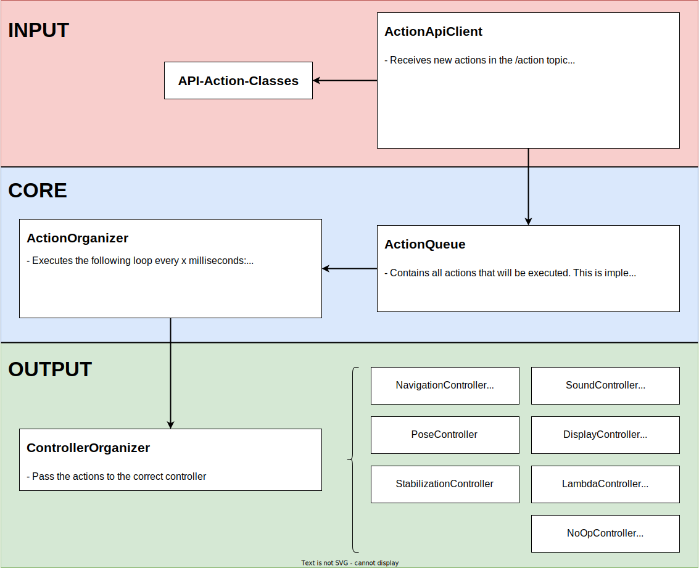
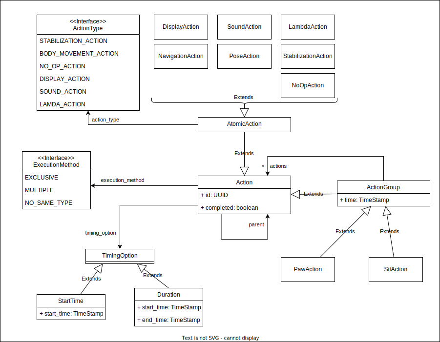

# ENAMOUR Core

The core of the enamour application. It receives intents and publishes them on a ros topic.
Further it receives actions and adds them to the action queue. Every X milliseconds the current action is fetched
from the queue and executed. The controllers are responsible for actually applying the actions to the
external systems like the robot, display or speaker.

## Run the application

Build the project with catkin_make or the make.sh script and then execute:

- `roslaunch enamour_core bringup.launch`

## Api Documentation

The [Api documentation](openapi.yaml) is written in the openapi v3 format. To view the api specification open a viewer
for example [swagger.io](https://editor.swagger.io/). Just paste the content of the yaml file into the editor.

## Application Architecture

### General Application Overview

### Composition of the action classes

### Selection Algorithm of to-be-executed actions within an action group

#### Get next actions for current time stamp in action group:

- For all action in action group:
    - If already completed -> Remove from group -> Process next action
    - If it should be completed by the current time stamp -> Mark as completed -> Remove from group -> Process next
      action
    - If the current time stamp is within the timing option of the action -> select action (see below)

#### Select action for execution in action group:

- If action is an action group:
    - If has execution method == MULTIPLE -> Add action to execution list
    - If has execution method == NO_SAME_TYPE -> Throw error (should not happen)
    - If has execution method == EXCLUSIVE -> If execution list is empty -> Add to execution list
- If action is an atomic action:
    - If has execution method == MULTIPLE -> Add action to execution list
    - If has execution method == NO_SAME_TYPE -> If execution list does not contain action with same type ->
      Add to execution list | else Throw error
    - If has execution method == EXCLUSIVE -> If execution list is empty -> Add to execution list |
      else Throw error (Cannot delay the execution of an atomic action)